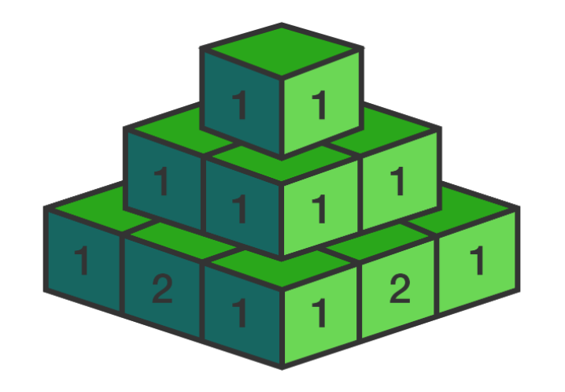
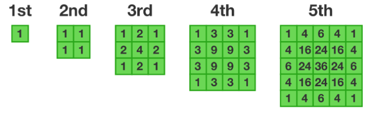

Imagine a pyramid made out of blocks, where the first layaer has 1 block, the second layer is 2x2 square made up of 4 blocks, the third layer is a 3x3 square made up of 9 blocks, and so on, so that each n-th layer is a square made from n^2 blocks

Each block has a number written on it. The top block has the number 1 written on it, but every other block has the sum of all the blocks that touch its top side written on it. The first five layer are follows:

What number would be written on the block that is in 3rd column and 4th row of the 100th layer?

NOTE: This problem does not require a programming solution, although you may want to use a calculator for the last step!
